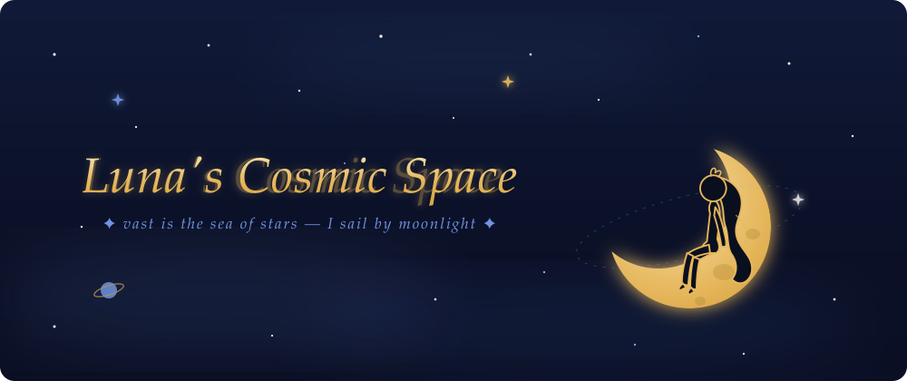
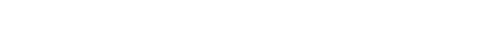
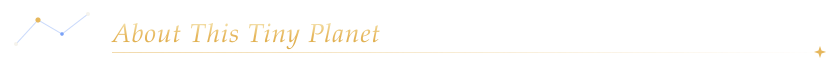
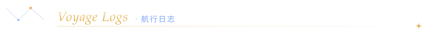
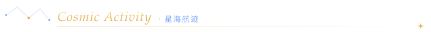
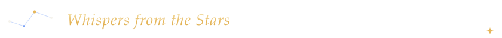
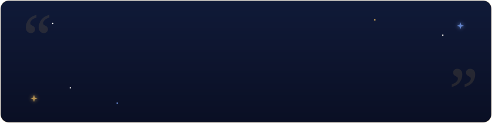
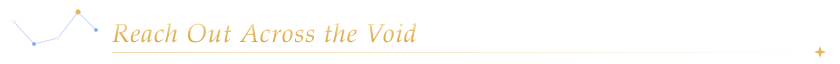
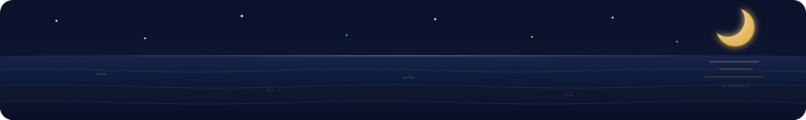

<div align="center">





<br/>


</div>

<br/>



<picture>
  <source media="(prefers-color-scheme: dark)" srcset="https://raw.githubusercontent.com/YxLuna/YxLuna/output/github-snake-dark.svg" />
  
</picture>

```yaml
name:       Luna
location:   somewhere between Earth & the Moon
languages:  [中文, English]
currently:  sailing the vast sea of stars
learning:   "the language of moonlight & machines ✨"
motto:      "Per aspera ad astra"
            (Through hardships to the stars)
```

<br clear="right"/>


<div align="center">


</div>

<br/>



<div align="center">

<a href="https://github.com/YxLuna/yx-mind-release"></a>
<a href="https://github.com/YxLuna/MusicPlayer"></a>

</div>

<br/>



<div align="center">


<br/><br/>


<br/><br/>


</div>

<br/>



<div align="center">



</div>

<br/>



<div align="center">

<a href="https://www.yx-bot.top"></a>
&nbsp;
<a href="https://space.bilibili.com/288150231"></a>
&nbsp;
<a href="https://github.com/YxLuna"></a>
&nbsp;
<a href="mailto:3534318786@qq.com"></a>

<br/><br/>


</div>

<br/>

<div align="center">



<sub>🌙 <i>From Luna with love · each commit, a lantern adrift on the sea of stars</i> 🌙</sub>

</div>
